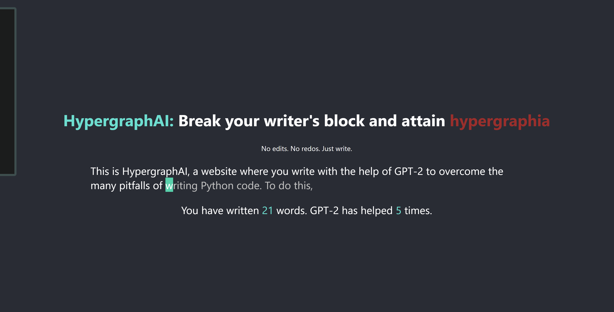

### HypergraphAI: Break your writer's block and attain hypergraphia (HackMIT 2020 Project)
Hypergraphia: intense desire to write.

Have writer's block? Can't force yourself to write? HypergraphAI uses the GPT-2 language model to
write for you!

After 3 seconds without typing, GPT-2 will insert the next word for you. You can also
press enter to accept GPT-2's suggestions.

Don't worry too much about typoez or if the writing doesn't make
sense—just write!

---
### Tools Used
Built using React.js, Flask, and Huggingface.

### Demo
Video demo: [https://www.youtube.com/watch?v=iCm9XiwW0zM](https://www.youtube.com/watch?v=iCm9XiwW0zM)

